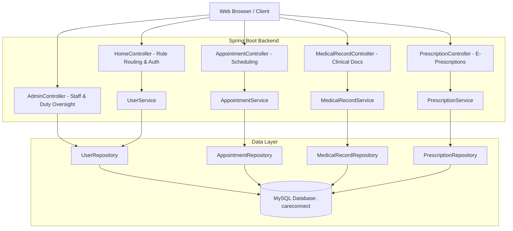

# 🏥 CareConnect - Electronic Health Record (EHR) System


**CareConnect** is a robust, web-based Electronic Health Record (EHR) and Hospital Management System designed to bridge communication and clinical workflows between **Patients**, **Healthcare Providers (Doctors)**, and **Hospital Administrators**.

---

## 🌟 Key Features by User Role

### 🩺 1. Patient Portal
- **Interactive Multi-Dashboard Login**: Convenient role-selection switcher with instant demo login.
- **Dynamic Doctor Booking**:
  - Book appointments by choosing doctors from a dynamic dropdown listing their name, medical specialization, available days, and clinic hours.
  - Automatic patient identification (no manual ID guessing).
  - Built-in validation to prevent past-date scheduling.
- **My Health Portal**:
  - View real-time status of appointments (**`CONFIRMED`**, **`PENDING`**, **`REJECTED`**).
  - Inspect clinical diagnoses and medical notes written by attending doctors.
  - View active prescriptions with medicine names, dosage, duration, and doctor instructions.

### 👨‍⚕️ 2. Doctor Dashboard
- **Appointment Schedule Management**:
  - Review incoming patient requests with patient names, contact numbers, and reasons for consultation.
  - One-click **Confirm** or **Reject** actions on patient appointments.
- **Clinical Documentation**:
  - Record patient diagnoses and comprehensive clinical progress notes.
- **E-Prescriptions**:
  - Issue itemized medication prescriptions with precise dosage, duration, and patient instructions.

### 🛡️ 3. Hospital Administration (Admin Dashboard)
- **Doctor Directory**:
  - Centralized catalog of registered medical specialists, departments, contact phone numbers, and emails.
- **Doctor Duty & Availability Management**:
  - Live statistics: Total Doctors, On-Duty (Available), and Off-Duty (Unavailable).
  - **1-Click Live Duty Toggle**: Instantly set a doctor On-Duty or Off-Duty.
  - **Inline Schedule Editor**: Update doctor clinic days and shift hours directly from the UI.
- **Patient Directory**:
  - Complete list of registered patients, contact info, and account details.
- **Hospital Appointment Oversight**:
  - Complete visibility into all hospital appointments across all departments.

---

## 🔑 Demo Accounts (Pre-Seeded)

The application automatically seeds default accounts on startup for immediate testing:

| Role | Email Address | Password | Portal Dashboard |
| :--- | :--- | :--- | :--- |
| **🛡️ Admin** | `admin@careconnect.com` | `admin123` | `/admin-dashboard` |
| **👨‍⚕️ Doctor** | `doctor@demo.com` | `doctor123` | `/doctor-dashboard` |
| **🩺 Patient** | `patient@demo.com` | `patient123` | `/patient-dashboard` |

> *Tip: You can also use the **Quick Test Login** buttons on the login page to fill demo credentials with 1 click!*

---

## 🏗️ System Architecture



---

## 🛠️ Technology Stack

- **Backend**: Java 17, Spring Boot, Spring Data JPA, Spring MVC
- **Frontend / Views**: Thymeleaf, HTML5, CSS3, Modern Responsive Layouts
- **Database**: MySQL 8.x
- **Build & Dependency Management**: Maven Wrapper (`mvnw`)

---

## 🚀 Getting Started

### 1. Prerequisites
- **Java Development Kit (JDK)**: Version 17 or higher
- **MySQL Server**: Running on `localhost:3306`

### 2. Database Configuration
Create a database named `careconnect` in MySQL:
```sql
CREATE DATABASE careconnect;
```

Update your credentials in [`src/main/resources/application.properties`](src/main/resources/application.properties) if different from the default:
```properties
spring.datasource.url=jdbc:mysql://localhost:3306/careconnect
spring.datasource.username=root
spring.datasource.password=YOUR_PASSWORD
```

### 3. Build & Run Application
From the project root directory:

**Using Maven Wrapper (Windows PowerShell / CMD):**
```powershell
.\mvnw.cmd spring-boot:run
```

**Using Maven Wrapper (Linux / macOS):**
```bash
./mvnw spring-boot:run
```

### 4. Access the Application
Open your web browser and navigate to:
```
http://localhost:8080
```
- Homepage: `http://localhost:8080/`
- Login Page: `http://localhost:8080/login`
- Register Page: `http://localhost:8080/register`

---

## 📁 Project Structure

```
careconnect/
├── src/main/java/com/careconnect/careconnect/
│   ├── CareconnectApplication.java     # Main Application & Demo Account Seeder
│   ├── controller/
│   │   ├── AdminController.java         # Admin & Availability Management
│   │   ├── AppointmentController.java   # Booking, Status & DTO mapping
│   │   ├── HomeController.java          # Authentication & Role Dispatcher
│   │   ├── MedicalRecordController.java # Clinical Records
│   │   ├── PatientPortalController.java # Unified Patient View
│   │   └── PrescriptionController.java  # E-Prescriptions
│   ├── dto/
│   │   └── AppointmentDTO.java          # View-friendly appointment model with names
│   ├── model/
│   │   ├── Appointment.java
│   │   ├── MedicalRecord.java
│   │   ├── Prescription.java
│   │   └── User.java
│   ├── repository/
│   │   ├── AppointmentRepository.java
│   │   ├── MedicalRecordRepository.java
│   │   ├── PrescriptionRepository.java
│   │   └── UserRepository.java
│   └── service/
│       ├── AppointmentService.java
│       ├── MedicalRecordService.java
│       ├── PrescriptionService.java
│       └── UserService.java
└── src/main/resources/
    ├── application.properties
    └── templates/
        ├── admin-dashboard.html         # Admin 2x2 grid dashboard
        ├── appointments.html            # Appointments table with names & status badges
        ├── book-appointment.html       # Dynamic doctor selection booking
        ├── doctor-availability.html     # Real-time duty schedule & on-duty toggle
        ├── doctor-dashboard.html        # Doctor hub
        ├── doctors.html                 # Doctor directory
        ├── index.html                   # Modern landing page
        ├── login.html                   # Multi-role tab login with demo fill
        ├── medical-records.html         # Clinical records
        ├── patient-dashboard.html       # Patient hub
        ├── patient-portal.html          # Unified patient portal
        ├── patients.html                # Admin patient directory
        ├── prescriptions.html           # Prescriptions
        └── register.html                # Account registration
```

---

## 📄 License
This project is licensed under the MIT License - open for educational and developmental purposes.
